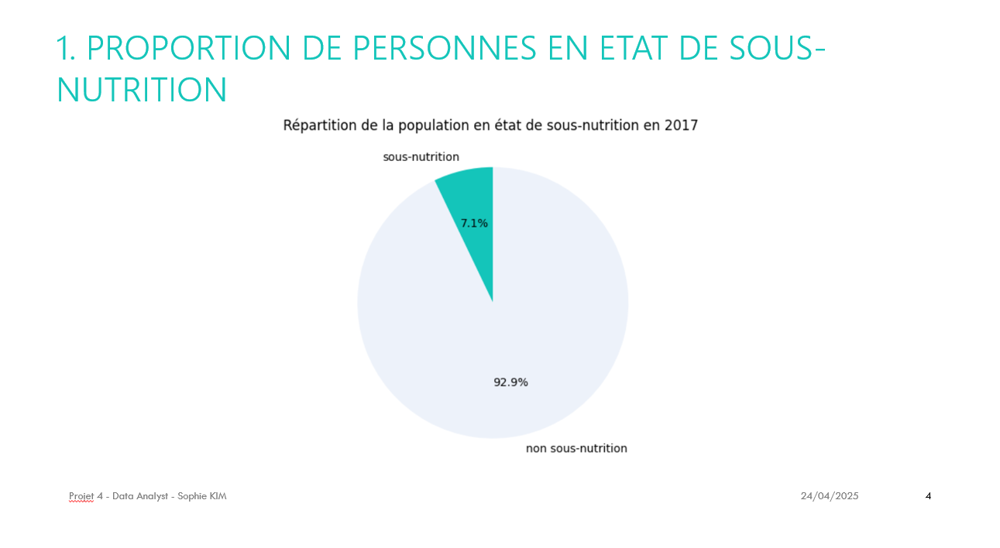
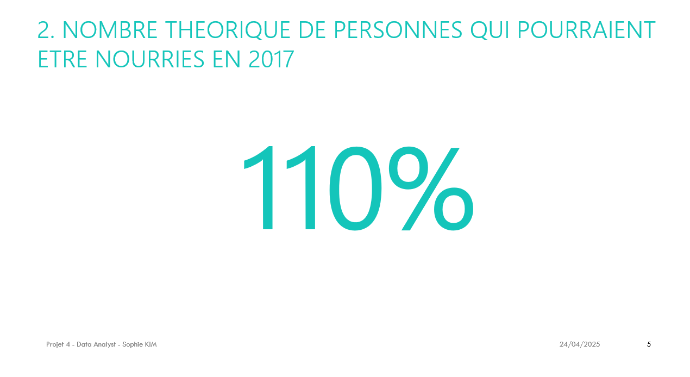
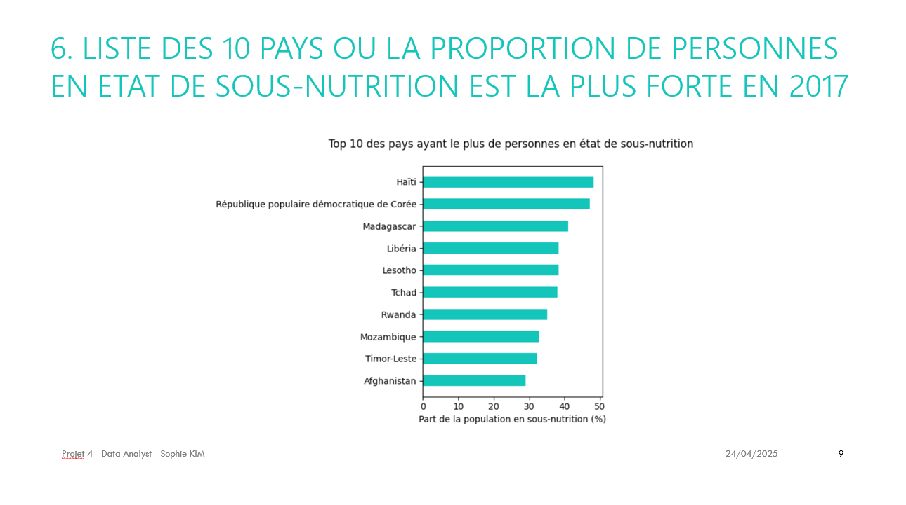
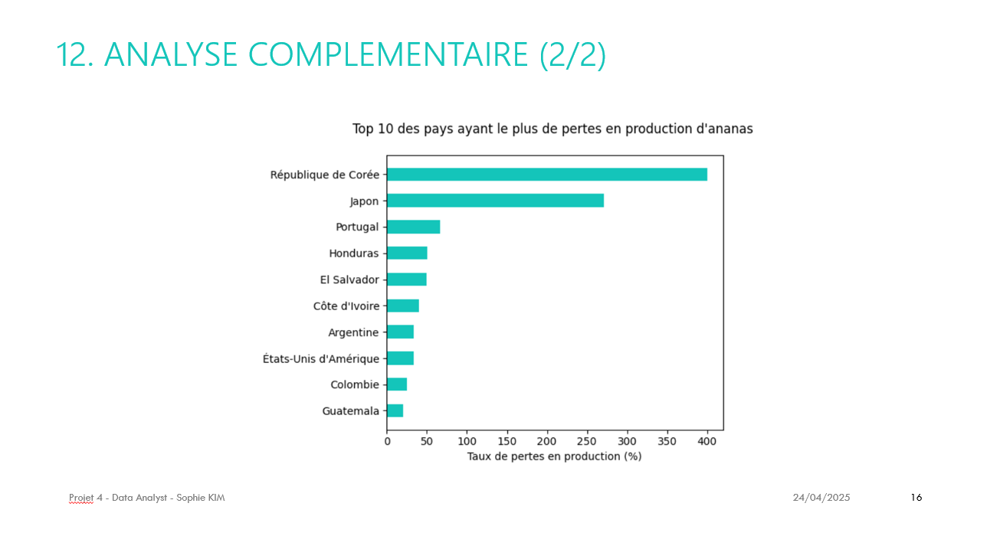

# Projet 4 - Réalisez une enquête de santé publique avec Python

## Contexte du projet

La mission de la **FAO (Food and Agriculture Organization of the United Nations)** est *« d'aider à construire un monde libéré de la faim »*.  

Dans ce cadre, mon rôle en tant que **Data Analyst** est de réaliser une **étude de grande ampleur** sur le thème de l’alimentation, et plus particulièrement sur la **sous-nutrition dans le monde**.

Pour mener cette analyse, je dispose de données relatives à :
- La population
- L’aide alimentaire
- La disponibilité alimentaire
- La sous-nutrition

---

## Objectifs pédagogiques

- Explorer et analyser des données en utilisant des **langages et outils métiers**

---

## Outils utilisés

- **Python**

---

## Résultats du projet

J’ai commencé par réaliser des **analyses exploratoires** sur les **quatre tables de données** afin de me familiariser avec les jeux de données, puis de les **nettoyer** et les **fusionner**.

### Principaux constats

- En **2017**, **7,1 % de la population mondiale** était en état de sous-nutrition, soit **plus de 535 millions de personnes**, un chiffre supérieur à la population totale de l’Union européenne cette année-là
- En théorie, il y avait en 2017 **plus de nourriture disponible que de « bouches à nourrir »**
- La **disponibilité intérieure** d’un pays n’est pas uniquement destinée à l’alimentation humaine (**49,51 %**), mais également à :
  - L’alimentation animale
  - Les semences
  - Les traitements
- Les **10 pays présentant les plus fortes proportions de sous-nutrition** comptent entre **30 % et 50 %** de leur population concernée  
  Ces pays se situent majoritairement en **Afrique de l’Ouest, centrale et australe**, ainsi que dans des zones d’instabilité telles que **Haïti** et **l’Afghanistan**

### Analyse complémentaire : le cas de l’ananas

Une analyse approfondie a été menée sur le cas de l’**ananas**.  
Parmi le **top 10 des pertes en disponibilité intérieure d’origine végétale**, l’ananas est le produit ayant subi les **pertes les plus importantes en 2017**.

Deux groupes de pays se distinguent :

- Les pays avec **peu de production et beaucoup d’importations**, affichant des taux de pertes très élevés :
  - **400 %** pour la République de Corée
  - **271 %** pour le Japon  
  L’ananas est un produit fragile, à **durée de conservation courte**, qui doit être récolté à un stade de maturité avancé, le taux de sucre et le goût n’évoluant plus après la récolte.

- Les pays avec **une production importante**, mais également **de fortes pertes**, comme :
  - Le Honduras
  - La Colombie
  - Le Guatemala

Ces constats soulignent la nécessité de mettre en place des **actions visant à réduire le gaspillage alimentaire** et à **optimiser la production et l’exportation d’ananas** à l’échelle mondiale.

---

## Compétences acquises

- Analyse de données provenant de **sources multiples**
- Utilisation de **Python** pour l’analyse de données

---

## Illustrations

### Visualisations des analyses
  
  
  

